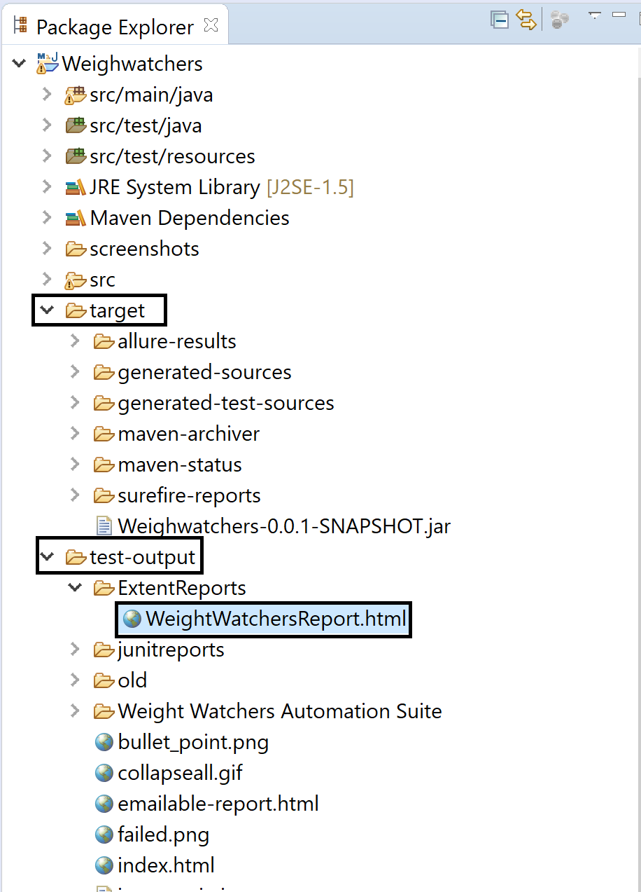

<p align="center">

</p>

# Selenium WebDriver Automation Framework

The purpose of the project is to selenium webdriver framework for web applications using Java TestNG Maven setup.

## Tools & Technologies

* Automation Tools : SeleniumWebDriver(3.14.0)
* Language : Java
* Testing Framework : TestNG (6.11)
* Object Repository Design Pattern : Page Object Model
* Test Execution Report:  Extent Reports HTML Dashboard (2.41.2) & TestNG
* Browser Compatibility: Chrome and HeadlessChrome
* Screenshot:  Take screen shot API to cover the flow and caputer invalid screenshots
* Implicit wait
* Project Setup: Maven


# Project Structure

<p align="center">
<br />
</p>


* **com.weightwatchers.base:-**
Under this package we have TestBase.java class which manages the prep work which needs to be done before any test executes for example it has methods which initiate the chrome driver
paths and launch of browser etc. This is done to ensure for code re-usability and keep test code clean.

* **com.weightwatchers.data:-**
Under this package we have Constants.java file which holds the test data. This is again done to keep test code clean and avoid hard coding test data in test cases. Also if dataneeds to changed can be changed directly from here instead of changing every where its used in script. This also helps in code maintainbility.

* **com.weightwatchers.pages:-**
Under this package we have page locators file for each page we will be interacting in UI. Within each page locator file we will have implmented the methods which will be performed on that page. This is to again done to keep test code clean and locators in respective page so its easily accessible and referenced to page which they belong to. This is done to achieve Page Object Model. We have two pages we interact thus two java classes HomePage.java & WorkShopPage.java .

* **com.weightwatchers.Reporter:-**
Under this package we have standard code for extent reports which we will get generated post execution of tests. The ExtentReporter.java class implements IReporter testng interface
to keep track of test cases status passed failed etc. Thus all test cases are annonated thus this listner methods records those status and add them into extent report.

* **com.weightwatchers.util:-**
Under this package we have utilities files which we will using in our project for example TestUtil.java has helper method which we can use to take screenshot at the end of each test cases. For this project I am not using in test code however this can be used to take screenshot for example capturing error messages etc. By default if any test case fails it will take screenshot and save it screenshots folder under Projects root folder.

* **com.weightwatchers.tests:-**
Under this package we have written our automated test steps in WeightWatchersTest.java . You will notice some steps are grouped in single test case and for each priority and description is set. Thus they will be executed in that priority as they were layout in assignment. The decription explains what the test case is doing. 

# How to Setup & Run the project:-
These are ways:

* Step 1: Download the code from repository and import in the eclipse. File->Open Projects from File System
<p align="center">
<br />
</p>


* Step 2: Click on Directory and Navigate to source code folder you have dowloaded. Select the Folder & Click on Select Folder Button
<p align="center">
<br />
</p>

<p align="center">
<br />
</p>

* Step 3: Click on checkbox and click on Finish button
<p align="center">
<br />
</p>

* Step 4: Wait for the dependencies to be loaded
<p align="center">
<br />
</p>


* Step 5: Before we run the test this mandatory step as we have some special chars in page title. Right Click Project Weighwatchers->Properties. Under Resources select Other and from drop-down select UTF-8. Click Apply and Close button
<p align="center">
<br />
</p>

<p align="center">
<br />
</p>


* Step 6: Run test from testng.xml
<p align="center">
<br />
</p>


* Step 7: You will notice in Eclipse Console TestNG will start 
<p align="center">
<br />
</p>


* Step 7: You will notice in Eclipse Console WebDriver will initiate ChomeDriver Session 
<p align="center">
<br />
</p>

* Step 8: You will notice ChromeDriver will launch Chromer browser and all steps will execute in priority
<p align="center">
<br />
</p>

**OR You can execute at Class level**

* Step 1: Right Click on WeightWatchersTest.java->Run As->TestNG Test
<p align="center">
<br />
</p>

**OR You can execute from Command line as Maven**

* Step 1: Open the Project Folder root folder in Command Prompt
<p align="center">
<br />
</p>

```
   mvn clean install
```

* Step 2: You will notice it will download dependencies for the first time
<p align="center">
<br />
</p>


* Step 3: You will see it will execute test and test report number of test executed passed failed . Also it will print out the meetings details
<p align="center">
<br />
</p>

# Testoutput & Reports

* Eclipse Console Output will show meeting details 
<p align="center">
<br />
</p>

* Extent Dashboard HTML Report: Under target Folder->test-output->ExtentReports->WeightWatchersReport.html . Open this in Chrome browser
<p align="center">
<br />
</p>

* TestNG HTML Report: Under target Folder->test-output->index.html
<p align="center">
<br />
</p>

